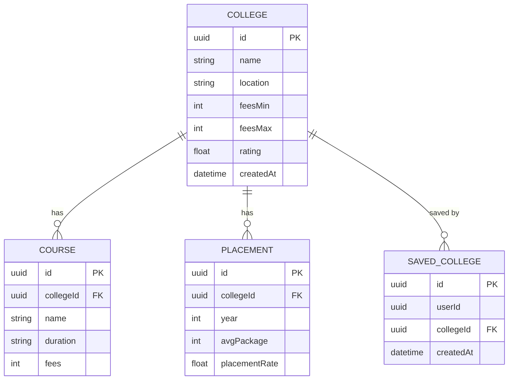

# College Discovery Platform

A full-stack college discovery platform built for **The AI Signal** Full Stack Engineer internship screening task.

**Live URL:** _(add after Vercel deployment)_
**Tech stack:** Next.js 16 (App Router) · TypeScript · Tailwind CSS · Supabase (Postgres + Auth) · Prisma ORM

---

## Features (deliberately scoped to 3, executed well)

| Feature | Status |
|---|---|
| College listing + search + filters (name, location, min-rating, fee range, pagination) | ✅ Working |
| College detail page (overview, courses table, historical placements) | ✅ Working |
| Auth + Saved Items (signup, login, save/unsave colleges, protected saved page) | ✅ Working |

**Out of scope (deliberate cuts):** Compare Colleges, Predictor Tool, Q&A/Discussion — cut to protect execution quality on the 3 chosen features.

---

## Architecture

### ER Diagram



> `SavedCollege.userId` references `auth.users.id` directly in Supabase — no separate local User table needed because Supabase Auth lives in the same Postgres instance.

---

## Key Architecture Decisions

### 1. Supabase for combined Postgres + Auth
Supabase provides a hosted Postgres instance that also manages the `auth.users` table in a separate schema. This means `SavedCollege.userId` can reference real user IDs without maintaining a separate local users table, and session cookies set by Supabase Auth are automatically available to Next.js API routes via `@supabase/ssr`.

### 2. Prisma as ORM with `PrismaPg` driver adapter
The generated Prisma client targets `prisma-client` (not the standard `@prisma/client`), which requires an explicit driver adapter. A globally-cached `pg.Pool` wrapped in `PrismaPg` is used to avoid connection exhaustion during Next.js hot-reloads in development.

### 3. Server-side filtering in `/api/colleges`
All filtering (location, min-rating, fee range, name search) is handled in the API route and pushed down to Postgres via Prisma `where` clauses. No client-side filtering — all data returned is already filtered by the DB query.

### 4. Interval-overlap fee filtering
Fee filtering uses an interval-overlap check, not a simple equality: `feesMax >= minFees AND feesMin <= maxFees`. This correctly returns colleges whose fee range overlaps the requested budget range, rather than only colleges entirely within it.

### 5. Decoupled Suspense boundaries on the homepage
The `SearchBar`, `FiltersBar`, and `CollegeGrid` are three separate components each wrapped in their own `<Suspense>` boundary. This prevents the search input from unmounting (losing focus) when the grid re-fetches — a bug that appeared with a single shared boundary.

### 6. Optimistic UI on bookmark toggle
`CollegeCard` updates its saved/unsaved visual state immediately on click, then sends the POST or DELETE request. If the request fails, it rolls back. If the user is unauthenticated, the 401 response redirects to `/login` rather than silently failing.

---

## Local Development

```bash
# 1. Install dependencies
npm install

# 2. Set environment variables — create .env:
NEXT_PUBLIC_SUPABASE_URL=...
NEXT_PUBLIC_SUPABASE_ANON_KEY=...
DATABASE_URL=postgresql://...?pgbouncer=true
DIRECT_URL=postgresql://...

# 3. Apply migrations (schema already migrated on the live DB)
npx prisma migrate deploy

# 4. Seed the database with 40 sample colleges
npx prisma db seed

# 5. Run the dev server
npm run dev
```

Open [http://localhost:3000](http://localhost:3000).

---

## API Routes

| Method | Path | Auth required | Description |
|---|---|:---:|---|
| `GET` | `/api/colleges` | No | List colleges — supports `search`, `location`, `minRating`, `minFees`, `maxFees`, `page`, `limit` |
| `GET` | `/api/colleges/[id]` | No | Single college with nested courses + placements |
| `GET` | `/api/saved` | Yes | Saved colleges for the authenticated user |
| `POST` | `/api/saved` | Yes | Save a college (`{ collegeId }` in body) — upserts, so duplicates are ignored |
| `DELETE` | `/api/saved/[collegeId]` | Yes | Unsave a college |

---

## Deployment

Deployed on Vercel. Required environment variables:

- `NEXT_PUBLIC_SUPABASE_URL`
- `NEXT_PUBLIC_SUPABASE_ANON_KEY`
- `DATABASE_URL` (Supabase connection pooler, port 6543)
- `DIRECT_URL` (Supabase direct connection, port 5432)
